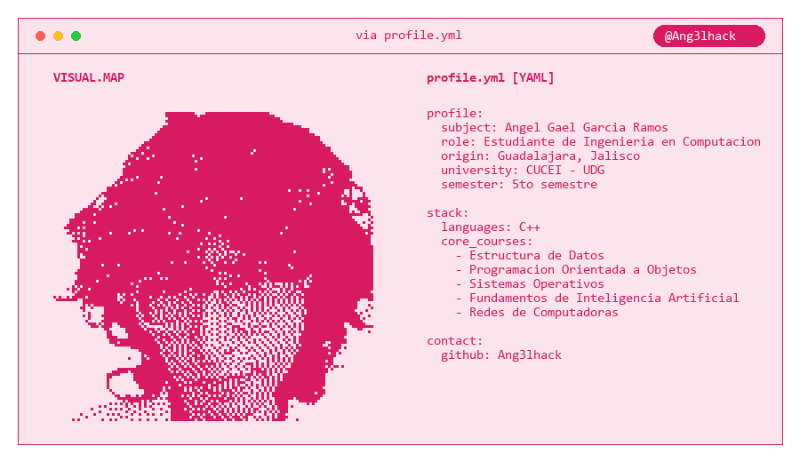

  <!-- Tu GIF que ahora contiene TODO (texto, ventana y animación) -->
  
  
    

  <h3>🛠️ Mi Tech Stack</h3>
  
  <!-- Insignias corregidas: Note que cambié C++ por C%2B%2B en el enlace para que no se rompan -->
  
  

